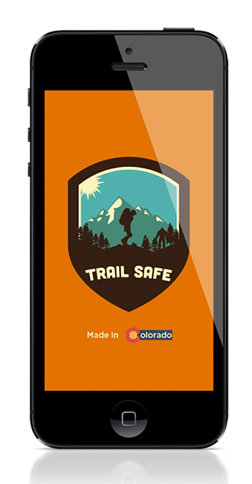

!SLIDE

!SLIDE

!SLIDE

# why we should win

* re-iterate the cost
* re-iterate the loss of lives
* reduces the risk
* causes us to worry less
* makes the outdoors more accessble
* makes it safer

* Colorado is state; beautiful countryside; moutains
* 41 state parks, 11 national forests, thousands of miles of trails